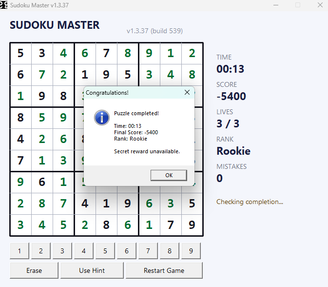
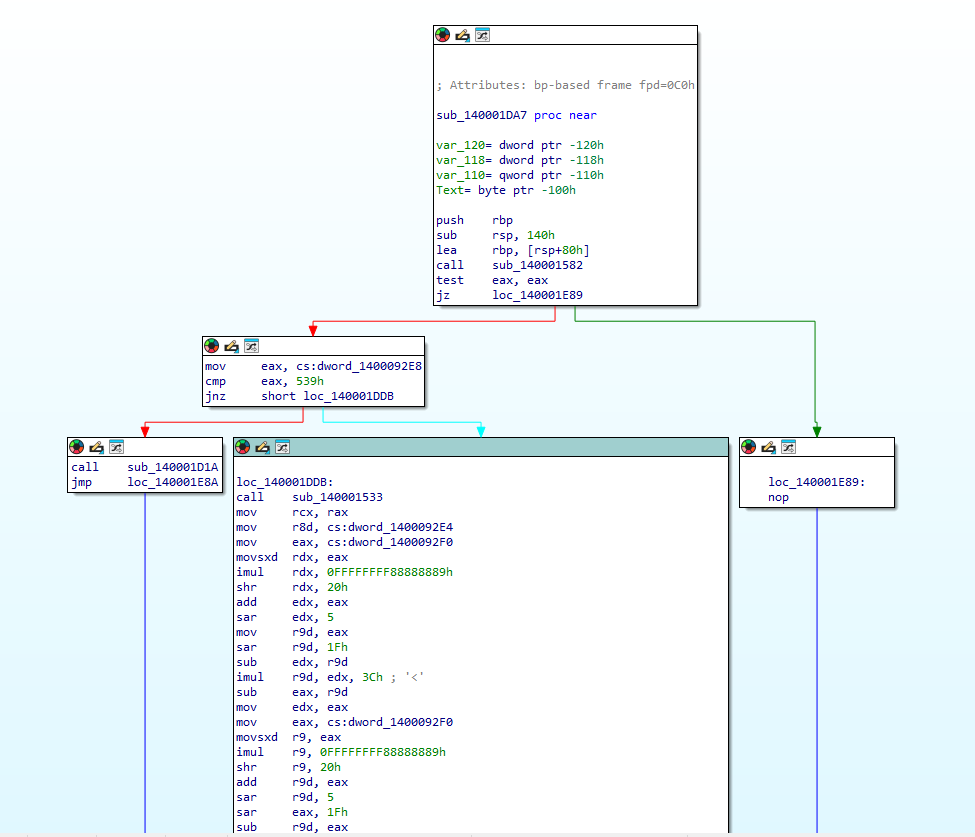

# Sudoku - Proof of Concept

> JCC 2026 - Reverse Engineering - Easy - UrSourceCode

This write-up uses only IDA Free and the participant-deliverable
`release/Sudoku.exe`. No source code or debugger is required.

## 1. Find the interesting string

After completing the puzzle, the game displays:

```text
Secret reward unavailable.
```



Open `release/Sudoku.exe` in IDA Free, wait for auto-analysis to finish, and
search for that string in the Strings window. Follow its DATA XREF. The
reference leads to the normal-win branch of the completion-check function.



## 2. Find the hidden condition

Inspect the nearby control-flow graph. The important instructions are:

```asm
mov     eax, cs:dword_1400092E8
cmp     eax, 539h
jnz     short normal_win
call    sub_140001D1A
```

`539h` is hexadecimal for decimal `1337`. The code is equivalent to:

```c
if (secret_score == 1337)
    reveal_flag();
else
    show_normal_win();
```

This explains why normal completion produces `Secret reward unavailable.`:
normal gameplay does not make the hidden score equal `1337`.

## 3. Decode the flag

Follow `sub_140001D1A`. It uses `0x5A` as the initial value and each ciphertext
byte as the next XOR value:


Raw IDA decompilation:

```c
__int64 sub_140001D1A()
{
    _BYTE v1[267]; // [rsp+20h] [rbp-60h] BYREF
    char v2; // [rsp+12Bh] [rbp+ABh]
    int i; // [rsp+12Ch] [rbp+ACh]

    v2 = 90;
    for ( i = 0; i <= 41; ++i )
    {
        v1[i] = v2 ^ byte_140006000[i];
        v2 = byte_140006000[i];
    }
    v1[42] = 0;
    return sub_140001975(a1: v1);
}
```

The same logic, rewritten with descriptive names, is:

```c
unsigned char previous = 0x5A;

for (int i = 0; i < 42; i++) {
    decoded[i] = encrypted[i] ^ previous;
    previous = encrypted[i];
}

decoded[42] = '\0';
show_flag(decoded);
```

The 42 bytes referenced by `byte_140006000` are:

```text
10 53 10 6B 18 6D 09 39 52 27 78 16 25 53 60 12
4D 2A 1B 6D 5E 01 6C 09 56 22 4A 79 26 55 30 53
61 52 26 79 0A 69 59 2B 4E 33
```

The `SUDOKU` bytes after the array belong to unused alternate mode data; they
are not used by this chained-XOR loop.

Use this small decoder:

```python
encrypted = bytes.fromhex(
    "10 53 10 6B 18 6D 09 39 52 27 78 16 25 53 60 12 "
    "4D 2A 1B 6D 5E 01 6C 09 56 22 4A 79 26 55 30 53 "
    "61 52 26 79 0A 69 59 2B 4E 33"
)

previous = 0x5A
decoded = bytearray()
for value in encrypted:
    decoded.append(value ^ previous)
    previous = value

print(decoded.decode("ascii"))
```

Output:

```text
JCC{sud0ku_n3v3r_g1v3_me_th3_sec23t_sc0re}
```

This static route recovers the flag directly from the executable.
