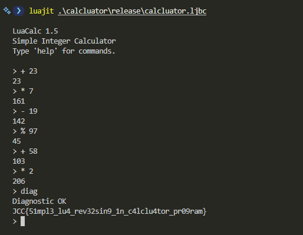

## Calcluator - Proof of Concept

> JCC 2026 - Reverse Engineering - Medium - UrSourceCode

### The Distributable Artifact

The release contains LuaJIT bytecode compiled with LuaJIT 2.1.1720049189 (x86_64).

Strings and constants can still be recovered with tools such as:

```bash
strings calcluator.ljbc
luajit -bl calcluator.ljbc
```

```
...
string
=c479d34633443c69c19b5002c1c2ecc66b858745aa2ab15051ae741cf5a5e0f07c10b23ccce6014fc6716c69268d74e
5765712076b155dcbe21fde9
```

```
-- BYTECODE -- calcluator.ljbc:0-0
0001    KSHORT   2   0
0002    KSHORT   3   1
0003 => KSHORT   4   0
0004    ISLT     4   0
0005    JMP      4 => 0009
0006    KSHORT   4   0
0007    ISGE     4   1
0008    JMP      4 => 0027
0009 => LOOP     4 => 0027
...
```

It will reveal the calcluator commands, the operators, blobs (target and encrypted), and `diag` command from `string.char(100, 105, 97, 103)`.

An online decompiler can also be used as quick starting point:
[Decompiler.com result for `calcluator.lua`](https://www.decompiler.com/jar/3e48e1521a443b66a29655dc1ec30eaa/calcluator.lua)

### Validation Mechanism

The program maintains four important values:

```lua
ans   = 0
state = 0x1337
step  = 0
bad   = 0
```

- ans   = current calculator result
- state = hidden internal state
- step  = how many operations have been entered
- bad   = how many wrong operations were entered

Each calculator operation updates `ans` and `state`. It also computes a signature:

```lua
x = (value + tag * 257 + step * 911 + (before % 65521) * 13) % 65521
sig = (x * 251 + (result % 65521) * 17 + state) % 65521
```

The operator tags are:

```text
+ is 17    - is 29    * is 43    / is 61    % is 79
```

So + 23 and * 23 will produce different checksums because their tags are different.

The program expects six specific checksum values:

```text
25943, 8305, 45430, 56405, 8638, 59901
```

After every calculation, the generated checksum is compared with the expected value for that step. If it does not match, bad increases.

The hidden diag command only decrypts the flag if:

```lua
step == 6
bad == 0
```

Means that exactly six operations were entered and all six matched the expected checksums.

Otherwise, it prints `Diagnostic failed`.

The encrypted flag is stored as hexadecimal bytes. The decryption seed is derived from the final calculator state and answer:

```lua
seed = (state + (ans % 256) * 257 + 0x5A) % 256
```

For the solved sequence, the final values are `ans = 206` and `state = 47516`, producing an initial decryption seed of `196`.

For every encrypted byte, the program advances a small linear generator and XORs the generated byte with the ciphertext:

```lua
seed = (seed * 73 + 41) % 256
plain_byte = ciphertext_byte XOR seed
```

This produces the flag only after the correct six-operation state has been established.

### Solving

Because each operand is restricted to `0..255`, the sequence can be recovered step by step. For each target checksum, brute-force all five operators and operands `0..255`, keep only candidates whose computed `sig` matches the current target, then continue with the updated `ans` and `state`.

The unique sequence is:

```text
+ 23
* 7
- 19
% 97
+ 58
* 2
diag
```

The intermediate answers are:

```text
0 + 23  = 23
23 * 7  = 161
161 - 19 = 142
142 % 97 = 45
45 + 58  = 103
103 * 2  = 206
```

At the end, `ans` is `206` and the final internal state is `47516`.



### Tips

1. When using `strings`, LuaJIT bytecode may include printable metadata or prefix bytes before the actual string constant. In this case, the useful encrypted hex string starts at `479d...`, not `=c479d...`.


